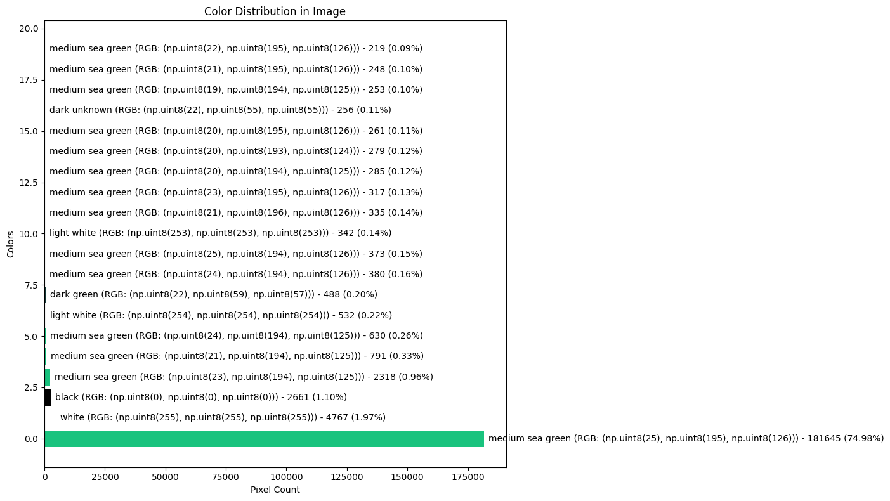

1. Extracts colors from images and names them based on RGB values
2. Generates color distribution statistics and visualizations
3. Performs pixel-by-pixel recoloring based on a color mapping

## Hybrid Approach to Color Replacement:

Uses NumPy's vectorized operations for common colors (faster for frequently occurring colors)
Uses pixel-by-pixel replacement only for rare colors (more efficient for sparse colors)
Automatically determines which approach to use based on color frequency

## Numba Acceleration:

Added @jit decorator to speed up the pixel iteration for rare colors
This can provide 10-100x speedup for pixel-by-pixel operations

##  Improvements:

Added batch processing capability for handling multiple images
Included progress tracking with tqdm
Optimized memory usage by operating on a single copy of the image array

## Performance Considerations:

The code now automatically determines which colors to process using vectorized operations vs. pixel-by-pixel approach
For images with only a few distinct colors, this hybrid approach should be significantly faster
The threshold for "rare" vs "common" colors can be adjusted based on your specific needs.

